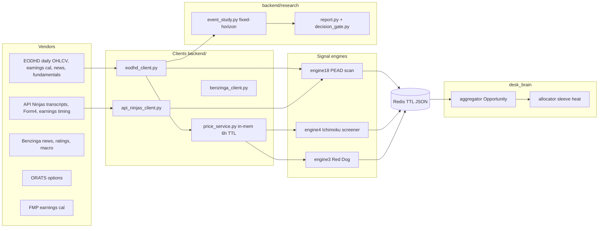
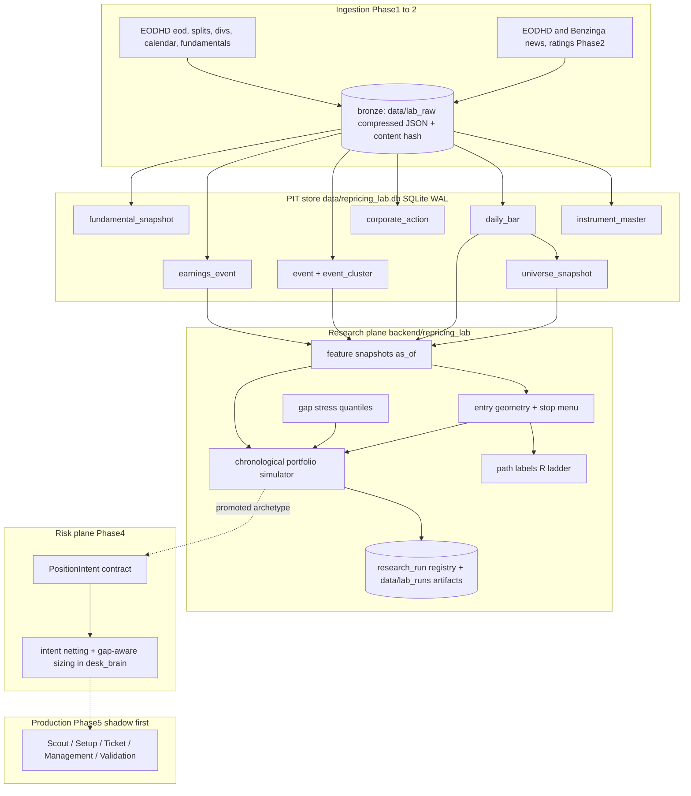

# NRGX Equity Repricing Lab — Implementation Plan

**Status:** Planning complete, awaiting approval. No production code written.
**Date:** 2026-07-15
**Source specification:** `NRGX_Equity_Repricing_Lab_Cursor_Planning_Prompt.md`
**Audit basis:** full repository inspection (engine 18, `backend/research/`, all data clients, Desk Brain, platform infra, trend engines) — every path cited below was verified in the working tree.

---

## 1. Executive recommendation

**Build a shared Equity Repricing Lab, not Engine 19.**

1. **What to build first:** a durable point-in-time (PIT) data foundation (SQLite, following the Engine 14 `chain_cache` precedent) + a chronological portfolio simulator with path-dependent R labels, layered on top of the existing `backend/research/` provider protocols. No new engine registration, no UI, no production routes until the bake-off produces a promote decision.
2. **Shape:** hybrid —
   - **Research plane:** a new `backend/repricing_lab/` package that extends (does not replace) `backend/research/`. The existing event-study harness stays intact as the benchmark-replay tool.
   - **Risk plane (later):** a typed `PositionIntent` contract added to `backend/desk_brain/` so E18, Ichimoku, and any promoted lab archetype express intent to one allocator. Desk Brain already detects duplicate tickers (25% haircut in `allocator.py`) but does not net exposure or size from stop geometry — that is the extension point, not a rewrite.
   - **Production plane (only after promotion):** most likely outcome is a hardened E18 plus at most one new archetype sleeve behind a single equities command surface. Engine number assignment is explicitly deferred.
3. **Recommended first long cohort:** **Candidate A — earnings-repricing continuation** (E18's event source + post-event acceptance + leadership + longer-hold management). It is the only cohort whose full data requirements (EODHD earnings actual/estimate + daily adjusted OHLCV) exist in the repo today. Candidates B/C/E (non-earnings catalysts, episodic pivots) require the event ledger for news/filings, which is Phase 2.
4. **Short research is not currently credible.** There is no borrow/fee/availability data anywhere in the repo (confirmed across all clients). Short-side work is blocked at the data layer, exactly as the spec's gate requires.
5. **Highest-risk assumptions:**
   - EODHD earnings-calendar `estimate` fields may be current-consensus backfills, not point-in-time estimates (leakage risk for surprise features). Must be tested empirically in the data-QA gate (PR 2).
   - EODHD delisted-symbol and historical-constituent coverage is unverified against the current subscription (`EODHD_API_TOKEN`). PIT universe quality depends on it.
   - No estimate-revision history, filings, or borrow data from any current provider — revision features and shorts need a future vendor decision.
   - All research to date (E18 bake-off, `backend/research/reports/`) was run on survivorship-biased current S&P 500 / NDX lists; existing "validated" numbers are optimistic and must be re-based.

---

## 2. Verified current-state architecture

### 2.1 Capability map

| Capability | Existing implementation | Exact paths | Reusable? | Gap | Action |
|---|---|---|---|---|---|
| PEAD engine | E18: EODHD earnings → ADV filter → transcript LLM/heuristic grade → deterministic beat×quintile sizing (full/half/pass), next-open entry, 10-day hold, no stops | `backend/engine18/` (`ingest.py`, `score.py`, `grade.py`, `pipeline.py`, `store.py`, `trades.py`), `scripts/refresh_engine18.py`, `backend/routers/engine18_pead.py`, `static/earnings-drift.*` | Yes — as benchmark B0 and event source | No `available_at`, weekday≠trading-day math, hardcoded cohort stats, live LLM grader ≠ validated heuristic | Replay exactly as B0; feed its earnings ingest into the canonical event ledger |
| Research harness | Event-study: `SignalEvent` → next-session open entry → fixed-horizon exit → flat bps costs; scorecard/decision gate (alive = OOS n≥30, avg>0, t≥1.5) | `backend/research/` (`event_study.py`, `cost_model.py`, `cohort_stats.py`, `splits.py`, `decision_gate.py`, `report.py`, `cli.py`, `strategies/`) | Yes — protocols, trading-day math, cohort stats | No portfolio sim, no stops/R labels, no PIT universe, no run versioning, no durable cache | Keep as benchmark tool; lab adds simulator + labels + PIT store |
| Trend engines | E4 Ichimoku + E3 Red Dog: full signal lifecycle in Redis (`engine4:signal:*`, 21d TTL), ATR stops, 1R/2R targets, shared `evaluate_outcome` (R, MAE/MFE, stop-first same-bar rule) | `backend/engine4_ichimoku.py`, `engine4_screener.py`, `engine4_backtest.py`, `engine3_red_dog.py` (esp. `evaluate_outcome`, lines ~779–885) | Yes — R-multiple walk logic is the seed for path labels; RS-vs-index code exists (`compute_relative_strength`, 63d excess return) | Per-signal walk only; no portfolio context; no gap-through-open fill (exits at stop price) | Generalize `evaluate_outcome` semantics into lab `labels.py` with gap-aware fills |
| Portfolio/risk | Desk Brain: sleeve heat allocator (`total_heat 6%`, `per_trade 1%`, account $25k), edge×conviction scoring, duplicate-ticker 25% haircut, LLM tilt clamped ±20% | `backend/desk_brain/` (`aggregator.py` `Opportunity`, `allocator.py` `allocate()`, `sleeves.py`, `paper.py`), `backend/routers/desk_brain.py` | Partially — aggregation/haircut pattern, paper logging | No netting (N rows kept per ticker), no sector caps, no stop/gap-based sizing, `risk_dollars`/`reward_r` ingested but ignored, static account equity | Add `PositionIntent` + netting in Phase 4; do not fork a second risk system |
| Technicals | ATR (Wilder), Bollinger width + squeeze (bottom-20% percentile), inside/outside day, Ichimoku series, RSI, MACD, EMA, volume metrics, VWAP proxy | `backend/technicals.py` | Yes — formulas reused in lab feature layer | No NR7, ADR%, 52-week distance, realized-vol percentile, turnover shock | Lab `features/` implements the missing ones as pure functions in the same style |
| Price data | `PriceService` (EODHD, split-adjusted via `adjusted_close` scaling, in-memory 6h TTL); research `EodhdPriceProvider` same approach | `backend/price_service.py`, `backend/research/live_providers.py` | Yes — as live-fetch layer | In-memory only; no durable bars; E18/E9 bypass it with raw `EodhdClient` | Lab persists bars into SQLite once, backfilled; live path keeps PriceService |
| Universe | Static current-membership text files (S&P 500, NDX) | `data/universe/sp500.txt`, `nasdaq100.txt`, `backend/research/universe.py`, `backend/universe.py` | No (biased) | Survivorship bias explicitly documented in code; no PIT membership, no delistings | Build PIT universe service (PR 1–2) |
| Persistence | Redis (TTL'd JSON via `backend/redis_store.py`), files in `data/`, SQLite for Engine 14 chains (`backend/engine14/chain_cache.py`, WAL, volume-mounted `app_data`) | `backend/redis_store.py`, `data/engine14_chains.db`, `docker-compose.yml` | Yes — SQLite precedent is the blessed durable-store pattern | No relational store for research entities; Redis TTLs make it unsuitable for audit history | New `data/repricing_lab.db` (SQLite WAL) + run artifacts under `data/lab_runs/` |
| Scheduling | cron inside app container (`deploy/crontab` installed by `deploy/entrypoint.sh`); scripts in `scripts/` | `deploy/crontab`, `Dockerfile`, `deploy/entrypoint.sh` | Yes | No job locks/observability beyond log file; acceptable for daily batch | Lab jobs follow the same `scripts/refresh_*.py` + crontab pattern |
| Config/flags | Frozen dataclass `FeatureFlags.from_env()` + `get_flags()`; `ENGINE_REGISTRY` dict (UI 1–18); routers 404 when `ENABLE_*` false | `backend/config.py` | Yes | — | Add `REPRICING_LAB_*` flags in the same dataclass |
| Testing | pytest, per-file fixtures + monkeypatch, `TestClient`, golden ORATS tapes (`tests/fixtures/golden/`), 122 test files | `tests/`, `scripts/generate_golden_payloads.py` | Yes | No property/invariance tests; no no-lookahead tests | Lab adds property tests + golden simulator replays |
| Deployment | GH Actions → SSH droplet `/opt/breach-algo` → `docker compose up -d --build app`; health `GET /api/health` | `.github/workflows/deploy.yml`, `deploy/` | Yes | — | Lab is backend + scripts only until MVP; deploy flow unchanged |

### 2.2 Contradictions and debt found

- **Engine numbering is dual:** UI numbers (`ENGINE_REGISTRY` in `backend/config.py`) ≠ backend module numbers (UI 5 = `engine4_ichimoku`; UI 3 = `engine5_lead_lag`). Any new number assignment must go through `ENGINE_REGISTRY`; the lab avoids taking a number at all in Phase 1–3.
- **Two definitions of "post-event":** spec assumed a post-event engine; the repo's Engine 8 (`engine8_post_event.py` router; UI 7) is an earnings-displacement CONTINUE/FADE evaluator, and Engine 9 is *credit stress*, not post-event. B3 benchmark maps to Engine 8's decision logic only loosely; treat E8 as context, not a replayable benchmark.
- **Business-day vs trading-day drift:** E18 uses weekday math (holidays ignored: `backend/engine18/models.py` `next_business_day`), while `backend/market_calendar.py` has real NYSE holidays and E14/E15 already use it behind flags. The lab must standardize on `market_calendar`.
- **E18 monthly validation replays a different strategy than the desk trades** (base PEAD without quality overlay) — noted for benchmark fidelity.
- **Risk-language mismatch:** Desk Brain sizes in "% heat by sleeve"; E3/E4 express R geometry; E18 expresses full/half/pass. No shared risk unit exists — the `PositionIntent` contract fixes this.
- `env.example` contains real-looking secret values in git; recommend rotation + redaction (see §20).

### 2.3 Current-state diagram



---

## 3. Specification assumptions: confirmed / partially correct / incorrect

| Spec assumption | Verdict | Repository evidence |
|---|---|---|
| `backend/engine18/pipeline.py` exists | Confirmed | Exists with `build_scan`/`build_profile`/`rescore_from_store` |
| `backend/engine4_ichimoku.py`, `engine4_screener.py`, `engine4_backtest.py` | Confirmed | All present; note UI calls this "Engine 5" |
| `backend/research/event_study.py`, `report.py` | Confirmed | Present; event-study only, not a portfolio simulator |
| `backend/gating.py`, `technicals.py`, `price_service.py`, `eodhd_client.py`, `universe.py`, `config.py`, `app.py`, `backend/routers/`, `static/ichimoku.js`, `static/nav.js` | Confirmed | All present |
| "Engine registry and actual next available engine number" | Partially correct | Registry exists (`ENGINE_REGISTRY`, UI 1–18) but UI numbers ≠ backend module numbers; "next number" would be UI 19, deliberately not assigned |
| Desk Brain owns portfolio risk | Partially correct | It budgets sleeve heat and haircuts duplicates, but does not net exposure, apply sector caps, or size from stops/gaps |
| A post-event engine exists | Partially correct | Engine 8 is post-earnings displacement evaluation (decision framework), not a replayable signal engine with outcomes |
| Existing research harness can be "extended or replaced as necessary" | Confirmed with caveat | Extension is right; its provider protocols and trading-day math are sound, but nothing portfolio-level exists |
| Benzinga/ORATS/EODHD/SEC/broker present | Partially correct | EODHD/ORATS/Benzinga/API Ninjas/FMP/FRED confirmed; **no SEC EDGAR client** (Form 4 only via API Ninjas), **no broker API**, no borrow data |
| Redis conventions + cron scheduling | Confirmed | `redis_store.py` TTL'd JSON; cron in container via `deploy/crontab` |
| Relational DB may exist | Partially correct | No ORM/Postgres; stdlib SQLite used by Engine 14 (`chain_cache.py`) — this is the precedent the lab adopts |
| Intraday data availability | Incorrect (none) | No intraday bars anywhere; only delayed quote snapshots. Spec's "intraday optional" stance is forced: it is Phase 3+ and needs procurement |
| Estimate-revision history availability | Incorrect (none) | EODHD `/calendar/trends` is current-quarter consensus only; Benzinga ratings are rating/PT changes, not EPS revision time series |

---

## 4. Data-source and data-gap matrix

### 4.1 Provider matrix (verified against client code)

| Data domain | Provider / module | PIT quality | Depth | Delisted | Latency | Rate limits / caching | Fit |
|---|---|---|---|---|---|---|---|
| Daily OHLCV (adjusted) | EODHD `get_eod` via `backend/eodhd_client.py`, `price_service.py` | Good (as-traded + `adjusted_close`) | Deep (2018+ used; more available) | **Unverified** — EODHD serves delisted tickers on many plans; must probe | EOD | 3 retries, 429 honored; in-mem 6h TTL | Research + live |
| Earnings dates/actuals/estimates | EODHD `/calendar/earnings` (`get_calendar_earnings`); FMP + API Ninjas + Benzinga as timing cross-checks | **Suspect** — `estimate` may be revised post-hoc; BMO/AMC present but sparse | Multi-year | Follows price coverage | EOD-ish | 6h cache | Research with QA gate; live OK |
| BMO/AMC timing | API Ninjas `earnings_timing` (premium), Benzinga `time`, EODHD `before_after_market` | Mixed; three sources disagree at times | — | — | — | none (Ninjas) | Cross-validate in event ledger |
| Transcripts | API Ninjas `/earningstranscript` | Keyed (year, quarter); no publication timestamp | Good for large caps | — | — | none | Feature (quality grade) only |
| News/press releases | EODHD `/news` (timestamps), Benzinga `/news` (`created`) | Usable timestamps; theme layer currently discards them | Multi-year (verify) | — | Minutes | 1h/6h caches | Phase 2 event ledger source |
| Analyst ratings/PT | Benzinga `/calendar/ratings` | Action-dated (usable as events) | Years | — | — | 1h cache | Phase 2 revision-proxy events |
| Estimate revisions (EPS/rev consensus history) | **None** | — | — | — | — | — | **Missing**; deferrable (Candidate A ablation 3) |
| Fundamentals / shares outstanding / float | EODHD `/fundamentals/{symbol}` (blob exists; shares fields unread today) | Snapshot-only; no history guarantee | — | — | — | — | Available, needs normalization + probe |
| Splits / dividends | Not wired (EODHD has `/splits` and `/div` endpoints — client methods absent) | Vendor-dated | — | — | — | — | Add client methods (PR 1) |
| Historical index membership / PIT universe | **None** (static txt lists) | — | — | — | — | — | **Missing, required Phase 1** — build ADV/price-based PIT universe from bars instead of index membership |
| Delisted securities list | Not wired (EODHD exchange symbol list supports `delisted=1` — must verify entitlement) | — | — | — | — | — | Probe in PR 1; required for honest Tier-2 research |
| Intraday OHLCV | **None** | — | — | — | — | — | Missing, deferred (Stage 2 entry optimization only) |
| Sector/industry | `data/universe/sector_map.json` (ETF map); EODHD fundamentals `Sector/Industry` (current-only) | Not PIT | — | — | — | — | Acceptable static approximation Phase 1; flag as limitation |
| Short borrow/fee/utilization | **None** | — | — | — | — | — | **Missing — blocks all short research** (vendor decision deferred) |
| SEC filings (8-K, S-3, 424B) | **None** (no EDGAR client) | — | — | — | — | — | Phase 2+: EDGAR full-text is free; capital-structure flags depend on it |
| Live/delayed quotes | EODHD `/real-time`, `/us-quote-delayed`; ORATS live | Live only | n/a | seconds–minutes | 30s/10s caches | Live/shadow only |
| Market regime | `backend/market_intel/` HMM (`regime_snapshot()`), FRED spreads (Engine 9) | Model recomputable historically? **Unverified** | 1260d lookback | — | — | Weekly calibration | Use realized SPY trend/vol regime computed from bars for research (reproducible); MI v2 for live context |
| Costs/spread proxy | `backend/research/cost_model.py` flat bps tiers (8/10/20/45) | n/a | — | — | — | — | Extend to liquidity/price/vol-aware model |

### 4.2 Required-dataset classification

| Dataset | Classification |
|---|---|
| Daily adjusted OHLCV | Available, fit for purpose (persist durably for reproducibility) |
| Raw (unadjusted) OHLCV + split/div series | Available at vendor, requires new client methods + normalization |
| Earnings actual/estimate/timing | Available but **not proven PIT-safe** — QA gate required before trusting surprise features |
| Transcripts | Available (live use + quality feature); publication timestamp missing → conservative `available_at` = report_date+1 session |
| News/ratings events | Available, requires normalization + clustering (Phase 2) |
| PIT universe membership | Missing, required Phase 1 → **build from bars** (price/ADV eligibility computed as-of each date), not from index lists |
| Delisted coverage | Available at vendor (probe required); required for honest satellite-tier research |
| Shares outstanding / float | Available (fundamentals blob), requires normalization; float quality unknown → Phase 2 |
| Estimate revision history | Missing, deferrable (ablation A3 runs when acquired; Benzinga ratings serve as weak proxy) |
| Intraday bars | Missing, deferrable (Stage 2 execution research only) |
| Borrow/fee/availability | Missing, **blocks short-side production and research** |
| SEC filings / capital-structure flags | Missing, deferrable for liquid-core longs; required before satellite small-cap longs are promoted |

### 4.3 Procurement decisions (deferred, interfaces defined now)

- **Estimate revisions:** required capability = per-(ticker, metric, fiscal_period) consensus time series with as-of dates. Candidates: EODHD calendar/trends historical snapshots (self-archived going forward), or a dedicated estimates vendor. Interface: `EstimateRevisionProvider.get_snapshots(ticker, metric, start, end) -> list[EstimateSnapshot]`.
- **Borrow:** required capability = daily per-ticker availability, fee, utilization with history. Interface: `BorrowProvider.get_snapshots(...)`. No vendor named until short research is approved.
- **Intraday:** required capability = 1-minute bars for selected event days only. EODHD offers an intraday API (entitlement unverified). Decision deferred to Stage 2.
- **Self-archiving principle:** from PR 2 onward, every vendor payload the lab ingests is stored raw (bronze) so NRGX starts accumulating its own PIT archive of estimates/calendars/news even before any new vendor is purchased.

---

## 5. Target architecture

### 5.1 Layer map (spec layers → repo components)

| # | Logical layer | Reuse | New | Location |
|---|---|---|---|---|
| 1 | PIT instrument + universe history | `market_calendar.py`; EODHD client | instrument master, universe snapshot builder | `backend/repricing_lab/instruments.py`, `universe_pit.py` |
| 2 | Canonical event ledger | E18 `ingest.py` earnings fetch; Benzinga/EODHD news clients | `event`, `event_cluster` tables + normalizer | `backend/repricing_lab/events.py` |
| 3 | Event clustering/dedup | — | deterministic clustering (ticker × window × type), content hash | `backend/repricing_lab/events.py` |
| 4 | Fundamental/estimate history | EODHD fundamentals/trends | snapshot archiver (self-archive forward) | `backend/repricing_lab/fundamentals.py` |
| 5 | Price/volume/leadership/compression features | `technicals.py` formulas | feature snapshot builder, cross-sectional ranks | `backend/repricing_lab/features/` |
| 6 | Pre/post-event state classification | — | acceptance/retention/state features | `backend/repricing_lab/features/acceptance.py` |
| 7 | Entry geometry + structural invalidation | E3/E4 level logic patterns | candidate stop menu + selection rules | `backend/repricing_lab/geometry.py` |
| 8 | Gap/liquidity risk estimation | — | empirical gap-stress quantiles by cohort (trailing, no lookahead) | `backend/repricing_lab/gap_stress.py` |
| 9 | Path-dependent payoff labels | E3 `evaluate_outcome` semantics | R-ladder labels, MFE/MAE, time-to-R, gap-aware fills | `backend/repricing_lab/labels.py` |
| 10 | Chronological portfolio simulator | `cost_model.py` (extended) | day-loop simulator with constraints + audit log | `backend/repricing_lab/simulator/` |
| 11 | Position-intent generation | — | `PositionIntent` dataclass (shared schema) | `backend/repricing_lab/intents.py` |
| 12 | Cross-engine intent aggregation | `desk_brain/aggregator.py` | intent adapter: Opportunity→Intent, netting by (ticker, side, cluster) | `backend/desk_brain/intents.py` (Phase 4) |
| 13 | Portfolio allocation + heat | `desk_brain/allocator.py` | gap-aware sizing + sector/cluster caps | extend `allocator.py` (Phase 4, flag-gated) |
| 14 | Signal lifecycle + shadow validation | E4 signal store pattern; E18 trades tracker | lab signal store (durable SQLite + Redis mirror) | `backend/repricing_lab/signals.py` (Phase 5) |
| 15 | Production command surface | router/static conventions | Scout/Setup/Ticket/Management/Validation | Phase 5 only, post-promotion |

### 5.2 Target diagram



### 5.3 Per-layer contracts (summary)

Every lab module follows these conventions:

- **Inputs/outputs:** typed frozen dataclasses (repo style — no pydantic in research code), ISO date strings, all times UTC.
- **Persistence:** silver entities in SQLite via a single `store.py` (mirrors `backend/engine14/chain_cache.py`: WAL, `PRAGMA busy_timeout`, executemany upserts). Gold run artifacts as JSON under `data/lab_runs/{run_id}/`. Redis only for live/shadow operational state (Phase 5).
- **Idempotency:** every ingest keyed by natural dedup key + `content_hash`; re-running a backfill is a no-op upsert. Every job writes a `lab:job:{name}:last_run` status row (SQLite table `job_run`).
- **Error behavior:** vendor failures skip-and-record (`skipped` rows with reasons — same philosophy as `event_study.EventStudyOutcome.skipped`), never silently optimistic.
- **Observability:** counts + coverage ratios logged and persisted per run; QA report artifact per backfill.
- **Tests:** pure logic unit-tested offline with in-memory providers; ingestion tested with recorded fixtures (golden-tape pattern from `tests/fixtures/golden/`).

---

## 6. Canonical schemas

All silver tables live in `data/repricing_lab.db` (SQLite, WAL). Path from `REPRICING_LAB_SQLITE_PATH` (mirrors `ENGINE14_SQLITE_PATH`). Times: `*_at` are UTC ISO-8601 strings; `*_date` are `YYYY-MM-DD` session dates. Every table carries `source`, `ingested_at`, and (where meaningful) `available_at`. **Leakage rule: a research decision at as-of time T may only read rows with `available_at <= T`.**

```sql
-- Instrument identity (survivorship-safe). instrument_id is internal and stable
-- across ticker changes; symbol history handled via symbol_map.
CREATE TABLE instrument_master (
  instrument_id   TEXT PRIMARY KEY,          -- e.g. "eodhd:AAPL.US" or uuid once mappings exist
  symbol          TEXT NOT NULL,             -- current/last-known ticker
  exchange        TEXT, security_type TEXT, country TEXT,
  first_trade_date TEXT, last_trade_date TEXT, delisted_at TEXT,
  adr_flag INTEGER DEFAULT 0, etf_flag INTEGER DEFAULT 0, active_flag INTEGER DEFAULT 1,
  source TEXT NOT NULL, ingested_at TEXT NOT NULL, updated_at TEXT NOT NULL
);
CREATE TABLE symbol_map (                    -- ticker changes / vendor aliases
  instrument_id TEXT NOT NULL, symbol TEXT NOT NULL,
  valid_from TEXT NOT NULL, valid_to TEXT,   -- NULL = current
  source TEXT NOT NULL, ingested_at TEXT NOT NULL,
  PRIMARY KEY (instrument_id, symbol, valid_from)
);

CREATE TABLE daily_bar (
  instrument_id TEXT NOT NULL, session_date TEXT NOT NULL,
  open REAL, high REAL, low REAL, close REAL,     -- as-traded (raw)
  adjusted_close REAL, adj_factor REAL,           -- vendor adjustment as of ingest
  volume REAL,
  ca_version INTEGER NOT NULL DEFAULT 1,          -- bump when re-adjusted after new corporate action
  source TEXT NOT NULL, available_at TEXT NOT NULL, ingested_at TEXT NOT NULL,
  PRIMARY KEY (instrument_id, session_date)
);

CREATE TABLE corporate_action (
  instrument_id TEXT NOT NULL, action_type TEXT NOT NULL,  -- split|dividend|symbol_change|delisting|merger
  effective_date TEXT NOT NULL, announcement_date TEXT,
  ratio_or_amount REAL, detail_json TEXT,
  source TEXT NOT NULL, available_at TEXT NOT NULL, ingested_at TEXT NOT NULL,
  raw_uri TEXT, content_hash TEXT,
  PRIMARY KEY (instrument_id, action_type, effective_date)
);

CREATE TABLE universe_snapshot (
  snapshot_date TEXT NOT NULL, instrument_id TEXT NOT NULL,
  universe_tier TEXT NOT NULL,               -- tier1_liquid_core | tier2_satellite | tier3_short_eligible
  price REAL, adv20_usd REAL, adv60_usd REAL, market_cap REAL,
  eligible_long INTEGER NOT NULL, eligible_short INTEGER NOT NULL DEFAULT 0,
  exclusion_reasons TEXT,                    -- JSON array of reason codes
  builder_version TEXT NOT NULL, as_of TEXT NOT NULL,
  PRIMARY KEY (snapshot_date, instrument_id, universe_tier)
);

CREATE TABLE raw_payload (                   -- bronze index; blobs on disk
  content_hash TEXT PRIMARY KEY,
  provider TEXT NOT NULL, endpoint TEXT NOT NULL, params_json TEXT NOT NULL,
  retrieved_at TEXT NOT NULL, uri TEXT NOT NULL   -- data/lab_raw/{provider}/{yyyymm}/{hash}.json.gz
);

CREATE TABLE event (
  event_id TEXT PRIMARY KEY,                 -- deterministic: hash(instrument, type, published_at, source_doc)
  instrument_id TEXT NOT NULL,
  event_type TEXT NOT NULL, event_subtype TEXT, direction TEXT,   -- pos|neg|mixed|unknown
  title TEXT, source TEXT NOT NULL, source_document_id TEXT,
  effective_at TEXT, published_at TEXT, available_at TEXT NOT NULL,
  session_bucket TEXT NOT NULL,              -- premarket|regular|afterhours|nontrading
  decision_session TEXT NOT NULL,            -- first session on which the event is actionable
  materiality REAL, novelty REAL, confidence REAL,
  structured_json TEXT, source_excerpt TEXT,
  raw_uri TEXT, content_hash TEXT,
  llm_model TEXT, llm_prompt_version TEXT, llm_validated INTEGER,  -- NULL when deterministic
  created_at TEXT NOT NULL, revised_at TEXT
);
CREATE TABLE event_cluster (
  cluster_id TEXT PRIMARY KEY, instrument_id TEXT NOT NULL,
  primary_event_id TEXT NOT NULL, canonical_event_type TEXT NOT NULL,
  canonical_direction TEXT, cluster_start TEXT NOT NULL, cluster_end TEXT NOT NULL,
  member_event_ids TEXT NOT NULL,            -- JSON array
  dedup_method TEXT NOT NULL, confidence REAL, created_at TEXT NOT NULL
);

CREATE TABLE earnings_event (
  instrument_id TEXT NOT NULL, fiscal_period TEXT,
  report_date TEXT NOT NULL, timing TEXT,    -- bmo|amc|during|unknown
  available_at TEXT NOT NULL,                -- conservative: session close of report day (amc) / open (bmo confirmed)
  decision_session TEXT NOT NULL,
  eps_actual REAL, eps_estimate REAL, eps_estimate_source TEXT,
  revenue_actual REAL, revenue_estimate REAL,
  estimate_is_pit INTEGER NOT NULL DEFAULT 0,  -- 1 only when estimate was archived before the print
  transcript_ref TEXT, guidance_json TEXT,
  source TEXT NOT NULL, revision_version INTEGER DEFAULT 1,
  content_hash TEXT, ingested_at TEXT NOT NULL,
  PRIMARY KEY (instrument_id, report_date, source)
);

CREATE TABLE estimate_snapshot (             -- self-archived from ingest date forward
  instrument_id TEXT NOT NULL, metric TEXT NOT NULL, fiscal_period TEXT NOT NULL,
  as_of TEXT NOT NULL, consensus_value REAL, analyst_count INTEGER,
  source TEXT NOT NULL, available_at TEXT NOT NULL,
  PRIMARY KEY (instrument_id, metric, fiscal_period, as_of, source)
);

CREATE TABLE fundamental_snapshot (
  instrument_id TEXT NOT NULL, as_of TEXT NOT NULL,
  shares_outstanding REAL, float_shares REAL, market_cap REAL,
  sector TEXT, industry TEXT,                -- current classification; not PIT (documented limitation)
  detail_json TEXT, source TEXT NOT NULL, available_at TEXT NOT NULL,
  PRIMARY KEY (instrument_id, as_of, source)
);

CREATE TABLE feature_snapshot (              -- gold; one row per (candidate context)
  snapshot_id TEXT PRIMARY KEY,              -- hash(instrument, as_of, feature_version)
  instrument_id TEXT NOT NULL, as_of TEXT NOT NULL,
  feature_version TEXT NOT NULL,
  features_json TEXT NOT NULL,               -- flat dict of named feature -> value|null
  quality_flags TEXT, source_versions TEXT, created_at TEXT NOT NULL
);

CREATE TABLE research_candidate (
  candidate_id TEXT PRIMARY KEY,
  run_id TEXT NOT NULL, strategy_version TEXT NOT NULL, archetype TEXT NOT NULL,
  instrument_id TEXT NOT NULL, side TEXT NOT NULL,
  decision_time TEXT NOT NULL, decision_session TEXT NOT NULL,
  event_cluster_id TEXT, feature_snapshot_id TEXT,
  entry_plan_json TEXT NOT NULL,             -- {variant, trigger, limit/zone}
  stop_plan_json TEXT NOT NULL,              -- {basis, price, structural_dist, gap_stress_dist, slippage_allow}
  reason_codes TEXT, vetoes TEXT,
  created_at TEXT NOT NULL
);

CREATE TABLE sim_order (                     -- simulator audit trail
  run_id TEXT NOT NULL, order_id TEXT NOT NULL,
  candidate_id TEXT, instrument_id TEXT NOT NULL, side TEXT NOT NULL,
  order_type TEXT NOT NULL,                  -- open|close|stop|limit|stop_gap
  submitted_session TEXT NOT NULL, filled_session TEXT,
  intended_price REAL, fill_price REAL, shares REAL,
  status TEXT NOT NULL,                      -- filled|partial|rejected_liquidity|rejected_heat|expired
  reject_reason TEXT,
  PRIMARY KEY (run_id, order_id)
);
CREATE TABLE sim_position (
  run_id TEXT NOT NULL, position_id TEXT NOT NULL,
  candidate_id TEXT NOT NULL, instrument_id TEXT NOT NULL, side TEXT NOT NULL,
  entry_session TEXT, entry_price REAL, shares REAL,
  stop_price REAL, risk_per_share REAL, planned_risk_pct REAL,
  exit_session TEXT, exit_price REAL, exit_reason TEXT,
  realized_r REAL, mfe_r REAL, mae_r REAL, holding_sessions INTEGER,
  lifecycle_json TEXT,                       -- ordered state transitions with timestamps
  PRIMARY KEY (run_id, position_id)
);

CREATE TABLE research_run (
  run_id TEXT PRIMARY KEY,                   -- {yyyymmddHHMM}-{git_sha8}-{config_hash8}
  kind TEXT NOT NULL,                        -- backfill|qa|labels|bakeoff|benchmark
  code_version TEXT NOT NULL,                -- git SHA
  config_json TEXT NOT NULL, config_hash TEXT NOT NULL,
  data_version TEXT, feature_version TEXT, strategy_version TEXT,
  cost_model_version TEXT, seed INTEGER,
  started_at TEXT NOT NULL, completed_at TEXT, status TEXT NOT NULL,
  result_uri TEXT                            -- data/lab_runs/{run_id}/
);

CREATE TABLE promotion_decision (
  decision_id TEXT PRIMARY KEY, run_id TEXT NOT NULL,
  strategy_version TEXT NOT NULL, archetype TEXT NOT NULL,
  decision TEXT NOT NULL,                    -- promote|revise|kill|insufficient_data|shadow|live
  criteria_json TEXT NOT NULL, decided_at TEXT NOT NULL, decided_by TEXT NOT NULL
);

CREATE TABLE job_run (
  job_name TEXT NOT NULL, started_at TEXT NOT NULL,
  finished_at TEXT, ok INTEGER, detail_json TEXT,
  PRIMARY KEY (job_name, started_at)
);
```

Deferred tables (schema reserved, created when their phase lands): `borrow_snapshot`, `intraday_bar`, `position_intent` (lives first as a dataclass; persisted in Phase 4), `live_signal` + `signal_transition` (Phase 5, mirrored to Redis for the UI).

**Dedup keys and time columns per entity** are as shown: every event-like row has `published_at` (source claim), `available_at` (earliest legitimate NRGX use — the research clock), `ingested_at` (actual receipt), and events derive `decision_session` once via `market_calendar` so session logic is computed in exactly one place.

**Retention:** silver tables are permanent (the whole point is audit history); bronze blobs permanent but compressed; `lab_runs` artifacts pruned manually; `job_run` rows kept 1 year.

---

## 7. Feature dictionary (Phase 1 core + Phase 2 flagged)

Feature layer contract: every feature is a pure function `f(ctx) -> float | None` registered with metadata `{name, formula, inputs, lookback, availability, null_policy, normalization, role, phase}`. No 0–100 composite score; raw values + reason codes persist in `feature_snapshot.features_json`. Cross-sectional percentiles are computed **within the PIT universe on the as-of date only**.

### 7.1 Event and fundamental (role: filter/ranker)

| Feature | Formula | Availability | Null policy | Phase |
|---|---|---|---|---|
| `eps_surprise_pct` | `(actual−est)/abs(est)`; None if `abs(est)<1e-9` (reuse `EarningsEvent.eps_surprise_pct`) | earnings `available_at` | null → cohort-excluded | 1 |
| `rev_surprise_pct` | same on revenue | same | null → allowed, flagged | 1 |
| `estimate_is_pit` | from ledger | ingest | — (data-quality flag, veto for strict cohorts) | 1 |
| `event_type/direction/materiality` | ledger fields (earnings deterministic; news via keyword rules first, LLM assist later with provenance) | event `available_at` | unknown → veto for event cohorts | 1 (earnings), 2 (news) |
| `guidance_direction` | deterministic keyword extraction from transcript/press release; LLM-assisted with stored prompt/version | transcript available_at (conservative: report+1) | null → neutral, flagged | 2 |
| `revision_magnitude/breadth/acceleration` | consensus deltas from `estimate_snapshot` archive | snapshot as_of | null → cohort variant without revisions | 2+ (data-gated) |
| `capital_structure_flags` | 8-K/S-3/424B parse (EDGAR) | filing available_at | missing → no flag, quality-flagged | 2+ |

### 7.2 Price and leadership (role: ranker/filter)

| Feature | Formula | Lookback | Phase |
|---|---|---|---|
| `ret_5/20/60/126/252` | `close[t]/close[t−n]−1` (adjusted) | n+1 bars | 1 |
| `rs_vs_spy_63` | `ret_63(stock) − ret_63(SPY)` (generalize `engine4_ichimoku.compute_relative_strength`) | 63 | 1 |
| `rs_pctile_universe_{20,63,126}` | cross-sectional percentile of return within PIT universe | window | 1 |
| `sector_rel_strength_63` | stock ret − sector-ETF ret (`data/universe/sector_map.json`) | 63 | 1 |
| `resid_momentum_63` | stock cum ret − β·SPY cum ret; β over 120d (pattern from `strategies/residual_reversal.py`) | 120+63 | 2 |
| `dist_ma_{20,50,200}` | `close/SMA_n − 1` | n | 1 |
| `dist_52w_high/low` | `close/max252(high) − 1`, `close/min252(low) − 1` | 252 | 1 |
| `ichimoku_state` | above/in/below cloud + bias (reuse `technicals.compute_ichimoku_levels`) | 52+26 | 1 |
| `ma_alignment` | 20>50>200 boolean ladder | 200 | 1 |

### 7.3 Event acceptance (role: filter — core of Candidates A/B)

| Feature | Formula | Phase |
|---|---|---|
| `event_gap_pct` | `open[e]/close[e−1] − 1` on decision session | 1 |
| `event_day_ret_pct/atr` | `close[e]/close[e−1] − 1`, and same ÷ ATR20 | 1 |
| `event_move_xsect_pctile` | percentile of event-day |ret| within same-day universe moves | 1 |
| `gap_retention_close` | `(close[e] − close[e−1]) / (open[e] − close[e−1])` when gap ≠ 0 | 1 |
| `move_retention_k` (k=1..5) | `(close[e+k] − close[e−1]) / (close[e] − close[e−1])` | 1 |
| `event_low_integrity_k` | `min(low[e+1..e+k]) > low[e]` | 1 |
| `gap_mid_hold_k` | `close[e+k] > (close[e−1]+open[e])/2` | 1 |
| `turnover_shock` | `volume[e] / mean(volume[e−20..e−1])` | 1 |
| `followthrough_volume_k` | mean relvol over e+1..e+k | 1 |
| `post_event_range_contraction` | mean TR(e+1..e+k) / TR(e) | 1 |
| `days_since_event` | sessions between event decision_session and as_of | 1 |

### 7.4 Compression/expansion (role: filter/ranker — Candidate D/E)

| Feature | Formula | Phase |
|---|---|---|
| `atr20_pct` | ATR20/close (Wilder — reuse `technicals.compute_atr_series`) | 1 |
| `atr_pctile_252` | percentile of ATR20/close vs own trailing 252 values | 1 |
| `adr20_pct` | mean((high−low)/close, 20) | 1 |
| `rv_pctile_{20v252}` | stdev of log returns 20d, percentile vs 252d history | 1 |
| `bb_width_pctile` | Bollinger bandwidth percentile (reuse `technicals.compute_bollinger_series` bandwidthPct + squeeze convention) | 1 |
| `nr7_flag`, `inside_day_count_10` | classic NR7; count of inside days in last 10 (extend `detect_candlestick_patterns`) | 1 |
| `range_contraction_3stage` | TR means over successive 5d windows strictly decreasing | 1 |
| `volume_dryup_20` | `mean(vol,5)/mean(vol,20)` | 1 |
| `consolidation_duration/depth` | sessions since last 20d-high touch; max drawdown within consolidation | 1 |
| `dist_to_invalidation_atr` | `(close − candidate_stop)/ATR20` | 1 |

### 7.5 Risk/portfolio (role: veto/sizing input)

| Feature | Formula | Phase |
|---|---|---|
| `adv20_usd`, `adv60_usd` | mean(close×volume, n) | 1 |
| `spread_proxy_bps` | cost-model tier by price/ADV/volatility (extended `CostModel`) | 1 |
| `gap_stress_per_share` | trailing cohort quantile (see §9/§10) | 1 |
| `earnings_proximity` | sessions to next scheduled earnings (calendar snapshots) | 1 |
| `sector_bucket` | static map (limitation flagged) | 1 |
| `overlap_e18/e4` | boolean: same ticker active in E18 scan / E4 tracker (live only) | 4 |
| `borrow_available/fee` | — | blocked (short gate) |

Winsorization: cross-sectional features winsorized at 1/99 pct within date; own-history percentiles used raw. Nulls: filters treat null as fail (conservative); rankers exclude nulls and flag coverage.

---

## 8. Research hypotheses and ablation matrix

Frozen-spec protocol (§17.2 of spec): hypotheses + grids + cost model frozen and recorded in `research_run.config_json` before the final bake-off; later changes create new `strategy_version`s.

### Benchmarks

| ID | Definition | Data | Notes |
|---|---|---|---|
| B0 | E18 PEAD exact replay: EODHD beats ≥5%, ADV≥$10M, next-open entry, 10-session hold, long-only, 10bps/side | earnings_event + daily_bar | reproduce `backend/research/strategies/pead.py` + heuristic quality overlay (the *validated* variant), on the PIT universe — expect degradation vs published numbers |
| B1 | B0 with 10/20/40-session holds × {fixed exit, ATR trail, time-stop/no-progress} | same | one axis at a time |
| B2 | Ichimoku replay: `engine4_backtest` detector on PIT universe under common costs/portfolio frame | daily_bar | reuses production detector — regression-guard that lab replication matches `engine4_backtest` outputs on identical inputs |
| B3 | Engine 8 post-event displacement rules as context cohort (no exact replay — E8 is a decision framework, not a signal log) | earnings_event + bars | measured for overlap only |

### Long candidates (deterministic cohorts; grids explicit)

| ID | Cohort | Grid |
|---|---|---|
| A | Earnings-repricing continuation: qualifying beat + acceptance + leadership + longer management | surprise ∈ {5,10,20%}; retention ∈ {40,60,80%}; leadership = rs_pctile_63 ∈ {≥50,≥70,≥90}; hold ∈ {10,20,40}; entry ∈ {next open, day-2 confirm, consolidation break} |
| B | Catalyst-accepted continuation (non-earnings events) — **Phase 2** (needs event ledger) | move ∈ {3,5,8,10% or ATR pctile ≥90}; turnover ∈ {1.5,2,3×}; retention ∈ {40,60,80%}; delay 0–5 sessions; stop ∈ {event low, consolidation low, gap mid, ATR} |
| C | Episodic-pivot subgroup: B ∩ dormant pre-state (ret_126 ≤ 0, low pre-event turnover, base formation) | pre-state thresholds × B grid (restricted) |
| D | Coiled leader: rs_pctile ≥ 90 + dist_52w_high ≥ −15% + compression (bb_width_pctile ≤ 20 or NR7/inside cluster) + volume dry-up + breakout trigger | compression defn × trigger (20d-high break vs range break) × stop (contraction low vs ATR) |
| E | Catalyst-confirmed coiled leader: D ∩ event within 20 sessions | joint restricted grid |
| F' | Leadership-only vs leadership+compression control | isolates compression's marginal value |

### Deferred/gated short — Candidate G

Negative-catalyst failed reclaim, liquid easy-to-borrow only. **Blocked until a borrow provider exists.** No parabolic-exhaustion work. Research may run *diagnostics-only* (unsized) on negative earnings cohorts to size the future opportunity, clearly labeled non-promotable.

### Ablation ladder (applies to A, B/C, D/E independently)

```
L0 event only (or leadership only for D)
L1 + post-event acceptance (retention/integrity)
L2 + fundamental confirmation (guidance/revenue quality; revisions when data exists)
L3 + market/industry leadership
L4 + compression
L5 + entry trigger variant
L6 + regime filter (SPY 200dma trend + realized-vol regime — reproducible from bars)
L7 + portfolio overlap controls (simulator-level)
```
One layer changes at a time; every layer's marginal effect reported with bootstrap CIs.

---

## 9. Path-dependent labels

Computed per (candidate, entry variant, stop basis) after entry/stop are fixed from decision-time data only. Implemented in `labels.py`, generalizing `engine3_red_dog.evaluate_outcome`:

- `hit_2R_before_1R_dn`, `hit_3R…`, `hit_5R…`, `hit_8R…` within {10, 20, 40} sessions
- `time_to_{1,2,3,5}R` (sessions; None if never)
- `mfe_r`, `mae_r` over horizon
- `adverse_gap_flag/magnitude`: any open beyond stop; `gap_loss_r = (fill − stop)/risk_per_share`
- `realized_r_{fixedN, atr_trail, time_stop}` under standardized exits
- `right_tail_contrib`, `time_under_water`

Price-handling rules (explicit):

1. Entry fill: next-session **open** for market-on-open variants; trigger price + slippage for stop-entry variants; if the open gaps beyond the trigger, fill at open (never at trigger).
2. Stop fill: intra-session touch → stop price − slippage; **gap-through → fill at the open**, not the stop.
3. Same-bar entry+stop ambiguity: conservative **stop-first** rule (repo convention in `evaluate_outcome`).
4. Splits/dividends: labels computed on adjusted series; `ca_version` recorded; economic-consistency property test (§18).
5. Missing bars/halts: >3 missing sessions → position marked `data_gap`, excluded from headline stats, counted in coverage.
6. Delistings: exit at last available close, flagged `terminal_delisting` (loss taken as printed — no silent skip).

---

## 10. Chronological portfolio simulator

`backend/repricing_lab/simulator/` — deterministic day loop, pure Python, no network:

```
for session in trading_calendar(start, end):        # market_calendar-based
    1. process corporate actions / delistings on open positions
    2. evaluate overnight gaps: stops gapped through -> fill at open
    3. fill queued entry orders (open / stop / limit semantics, slippage by liquidity tier)
    4. mark positions; update trails, time stops, adds (adds only after >= +1R, within heat)
    5. read today's candidates (decision_session == session, available_at enforced by construction)
    6. apply vetoes -> size (see §11) -> apply portfolio constraints in deterministic priority:
       per-name risk cap -> ADV participation cap -> sector cap -> cluster/duplicate cap ->
       gross/net exposure cap -> max positions -> cash
       (each rejection recorded with reason)
    7. queue orders for next executable session
    8. append daily book snapshot (NAV, gross/net, heat, sector heat) to run artifact
```

- **Fills:** MOO at open; stop entries at max(trigger, open); slippage = extended `CostModel` keyed by (price, ADV, ATR%) tiers; participation cap default 2% of ADV20 (configurable); orders exceeding cap partially filled or rejected (recorded).
- **Constraints (defaults, all configurable):** risk/position 0.25% NAV; max positions 20; gross ≤ 100%; sector ≤ 25% gross; same event-cluster ≤ 1 position; re-entry cooldown 5 sessions after stop.
- **Corporate actions:** split-adjust open positions via `corporate_action`; merger/delisting → terminal exit at last close.
- **Shorts:** structurally supported by side flag but **disabled** (`allow_short=False`) until borrow snapshots exist.
- **Reproducibility:** run registered in `research_run` with git SHA + config hash + seed; artifacts (daily book, orders, positions, scorecard) under `data/lab_runs/{run_id}/`; byte-identical replay on same inputs is a golden test.

What exists today vs added: existing harness provides trading-day navigation and cost presets only; **everything else in this section is new**.

---

## 11. Sizing and position-intent architecture

### Sizing (research + shadow)

```
risk_budget      = NAV × risk_pct (default 0.25%) × regime_mult × confidence_mult
risk_per_share   = max(structural_stop_dist, gap_stress_dist) + slippage_allowance
shares           = floor(risk_budget / risk_per_share)
shares           = min(shares, adv_cap_shares, notional_cap/price, cash_cap/price,
                       sector_remaining/price, cluster_remaining/price)
```

- **Gap stress:** trailing quantile (default q90) of next-open adverse gaps for the cohort (market-cap × liquidity tier × catalyst type), computed over the trailing 3 years **ending before the decision date** (no lookahead), refreshed monthly. Sparse cohorts fall back to the parent tier.
- **Anti-gaming property:** system may never pick the stop that maximizes R; the stop menu is fixed per archetype and the geometry module reports entry_efficiency for all stops on the menu.
- **Conflict with Desk Brain identified:** `DESK_BRAIN_PER_TRADE_RISK_PCT=1.0`, `DESK_BRAIN_ACCOUNT_SIZE=25000`, heat 6% (`backend/desk_brain/allocator.py` `RiskConfig`). Lab defaults (0.25%) are deliberately lower; at promotion the lab archetype enters Desk Brain with its own per-engine risk cap — Desk Brain's 1% remains the ceiling, not the default.

### PositionIntent contract (Phase 4)

Dataclass in `backend/repricing_lab/intents.py`, adopted by `desk_brain`:

```python
@dataclass(frozen=True)
class PositionIntent:
    intent_id: str; source_engine: str; strategy_version: str
    instrument_id: str; ticker: str; side: str          # long|short
    decision_time: str; expiry: str
    event_cluster_id: Optional[str]; archetype: str
    entry_zone: tuple[float, float]; trigger: str
    structural_stop: float; gap_stress_per_share: float; slippage_allowance: float
    requested_risk_pct: float; confidence: float        # 0..1
    reason_codes: list[str]; vetoes: list[str]
    correlation_cluster: str; shadow_only: bool
```

**Aggregation rules (deterministic, in `backend/desk_brain/intents.py`):**

1. Group intents by (ticker, side). Same side ⇒ **one economic exposure**: allocated risk = `max(requested_risk_pct)` × agreement multiplier (default 1.0; configurable ≤ 1.25 — agreement may increase confidence, never multiplies risk), stop = the **widest** structural stop among agreeing intents (honest invalidation), attribution list preserved on the merged position.
2. Opposite sides ⇒ surfaced as an explicit conflict (existing `conflicts` list in `TargetBook`); default action: no new entry, flag for desk.
3. Same event_cluster across tickers ⇒ cluster heat cap.
4. Legacy engines: adapter maps today's `Opportunity` rows into degraded intents (no stop geometry ⇒ sized under legacy sleeve path) so the transition is incremental and flag-gated (`DESK_BRAIN_INTENTS_ENABLED`).
5. Attribution: merged positions carry `contributors: [{engine, intent_id, requested_risk}]` so per-engine marginal contribution remains measurable in paper/live performance.

---

## 12. Evaluation and promotion framework

### Scorecard (per cohort × ablation layer, JSON artifact)

Trade-level: n_events (cluster-deduped), n_trades, expectancy_R (+bootstrap 95% CI), median_R, win_rate, payoff, MFE/MAE dists, time-to-R, right-tail share (top-decile contribution), adverse-gap freq/magnitude, cost drag, hold duration.
Portfolio-level: CAGR-equivalent, max drawdown, Calmar, time under water, gross/net exposure, turnover, ADV-participation capacity curve, sector/cap-tier/year/regime breakdowns, correlation vs B0/B2 replay P&L series, marginal Sharpe added to combined book.
Stress: 2× costs, +1-session delayed entry, gap-through stress, parameter perturbation map, drop-best-year, drop-best-sector, drop-top-5 trades, liquidity restriction both directions.

### Gate criteria (objective; recorded in `promotion_decision`)

| Decision | Criteria (all must hold unless noted) |
|---|---|
| **Promote (to shadow)** | ≥150 independent event-clusters OOS; after-cost expectancy ≥ +0.15R with bootstrap 95% CI > 0; positive in ≥2 of 3 walk-forward folds and ≥2 regimes; survives 2×-cost and 1-day-delay with expectancy > 0; no single sector >40% of P&L, top-5 trades <50% of P&L; correlation of daily P&L with existing engines < 0.6; positive marginal contribution to combined book |
| **Revise** | CI includes 0 but point estimate ≥ +0.10R, or fails exactly one stress test |
| **Insufficient data** | <150 independent events — extend window/universe before judging |
| **Kill** | expectancy ≤ 0 OOS, or edge concentrated in one year/sector, or dies under delay/cost stress |
| **Shadow → live** | ≥60 shadow signals AND ≥90 calendar days; shadow expectancy within CI of research; fill/slippage drift < 30% of modeled; candidate counts within 2× of research rate |
| **Live risk increase** | 6 months live + ≥100 signals within research CI → risk_pct may step 0.25%→0.50% |
| **Auto-disable (live decay)** | rolling 6-month live expectancy < 0 with n ≥ 30 (mirrors E18's DEGRADED convention) → shadow_only until re-validated |

Validation design: anchored walk-forward (train ≤2021 → validate 2022; ≤2022 → 2023; ≤2023 → 2024–2026), embargo 40 sessions around fold boundaries for overlapping labels; final frozen spec then a genuinely prospective shadow period. The existing `decision_gate.py` alive-rule (n≥30, t≥1.5) is retained as a *pre-filter* only.

---

## 13. Production MVP (described only; built after promotion)

- **API (proposed, follows bare-`APIRouter` + full-path convention):** `backend/routers/equity_repricing.py` → `GET /api/equity-repricing/scout|signals|signals/{id}|positions|validation|health`, `POST /api/equity-repricing/refresh`. 404 unless `REPRICING_LAB_PROD_ENABLED`.
- **Views:** Scout (ranked candidates + archetype + reason codes + freshness), Setup (event/source evidence, leadership, compression, regime, invalidators), Ticket (entry zone, structural stop, gap-stress, shares at 0.25%, ADV participation, scheduled-event warnings, overlap), Management (current R, MFE/MAE, exact validated exit rule, trail state, engine agreement), Validation (shadow-vs-research distributions, drift, pipeline health).
- **Storage:** durable signal lifecycle in SQLite (`live_signal`, `signal_transition`), Redis mirror for UI freshness (pattern: `lab:scan:latest` like `e18:scan:latest`).
- **Lifecycle states:** `candidate → qualified → pending_trigger → active → (partial|trailing) → stopped|time_stopped|exited|expired|invalidated|vetoed|data_stale` — superset of E4's tracker states, desk-owned states protected from auto-overwrite (E4 convention).
- **Jobs:** premarket candidate build (after E18's 12:45 UTC slot), after-close feature/lifecycle update, nightly QA.
- **Frontend:** one page `static/equity-repricing.html|.js` using `RavenUI` helpers; nav entry added only at promotion.
- **Permissions/flags:** invite-gate middleware (existing); `REPRICING_LAB_SHADOW_ONLY=1` default; refresh endpoint admin-token-gated like Engine 14 backfill.
- **Parity guard:** the production candidate generator imports the *same* feature/geometry modules as the research run and asserts `feature_version`/`strategy_version` equality against the promoted run — production cannot silently diverge from the validated backtest.

---

## 14. Exact files to create

| Path | Responsibility |
|---|---|
| `backend/repricing_lab/__init__.py` | package doc: lab contract, no production authority |
| `backend/repricing_lab/store.py` | SQLite open/migrate/upsert helpers (pattern: `backend/engine14/chain_cache.py`) |
| `backend/repricing_lab/schema.sql` | DDL from §6 (versioned migrations table) |
| `backend/repricing_lab/instruments.py` | instrument master + symbol map builders |
| `backend/repricing_lab/universe_pit.py` | PIT tier builder from bars (+reason codes) |
| `backend/repricing_lab/corporate_actions.py` | splits/dividends/delistings ingest + re-adjustment |
| `backend/repricing_lab/bars.py` | daily-bar backfill (EODHD → silver), raw+adjusted |
| `backend/repricing_lab/events.py` | event ledger: earnings (PR 2), news/ratings + clustering (Phase 2) |
| `backend/repricing_lab/fundamentals.py` | shares/mcap/sector snapshots + estimate self-archiver |
| `backend/repricing_lab/features/__init__.py` + `price_trend.py`, `relative_strength.py`, `compression.py`, `acceptance.py`, `event_fundamental.py`, `risk_liquidity.py`, `registry.py`, `snapshot.py` | feature dictionary implementation (§7) |
| `backend/repricing_lab/geometry.py` | stop menu, entry variants, entry-efficiency |
| `backend/repricing_lab/gap_stress.py` | trailing cohort gap quantiles |
| `backend/repricing_lab/labels.py` | path labels (§9) |
| `backend/repricing_lab/simulator/__init__.py`, `book.py`, `fills.py`, `costs.py`, `constraints.py`, `engine.py` | §10 |
| `backend/repricing_lab/benchmarks.py` | B0/B1/B2 replay adapters |
| `backend/repricing_lab/cohorts.py` | candidate cohort definitions + ablation grids (§8) |
| `backend/repricing_lab/runs.py` | research_run registry, config hash, artifact writer |
| `backend/repricing_lab/qa.py` | data-quality gate report (§17.1 of spec) |
| `backend/repricing_lab/intents.py` | `PositionIntent` dataclass (Phase 4 consumers) |
| `backend/repricing_lab/cli.py` | `python -m backend.repricing_lab.cli backfill|qa|features|labels|bakeoff|report` |
| `scripts/lab_probe_eodhd.py` | one-shot entitlement probe (delisted list, splits/divs, fundamentals shares, intraday) — output feeds §4 verification |
| `scripts/lab_backfill.py` | cron-safe wrapper for incremental daily ingest |
| `backend/desk_brain/intents.py` | Phase 4: Opportunity→Intent adapter + netting |
| `tests/test_lab_store.py`, `test_lab_universe_pit.py`, `test_lab_events.py`, `test_lab_features.py`, `test_lab_geometry.py`, `test_lab_labels.py`, `test_lab_simulator.py`, `test_lab_no_lookahead.py`, `test_lab_benchmarks.py`, `test_lab_qa.py`, `test_desk_brain_intents.py` | per-module tests (§18) |

## 15. Exact files to modify

| Path | Change | Phase |
|---|---|---|
| `backend/eodhd_client.py` | add `get_splits()`, `get_dividends()`, `get_exchange_symbols(delisted=...)`, `get_fundamentals_shares()` (thin, same retry/cache pattern) | PR 1 |
| `backend/config.py` | add `REPRICING_LAB_*` flags (§16); no ENGINE_REGISTRY change | PR 1 |
| `env.example` | document new flags (no secrets) | PR 1 |
| `deploy/crontab` | add nightly `scripts/lab_backfill.py` (after-close slot) | PR 2 |
| `Dockerfile` / `docker-compose.yml` | none expected — `data/` already copied and volume-mounted; verify `app_data` covers new db | PR 2 |
| `backend/research/cost_model.py` | add liquidity/vol-tiered model (backward-compatible classmethods) | PR 4 |
| `backend/desk_brain/aggregator.py`, `allocator.py` | Phase 4 only, behind `DESK_BRAIN_INTENTS_ENABLED`: consume merged intents; keep legacy path intact | PR 8 |
| `backend/app.py`, `static/nav.js` | Phase 5 only (post-promotion) | PR 9+ |

**Not modified:** `backend/engine18/*`, `backend/engine4_*`, `backend/research/event_study.py` core (benchmarks import, never edit).

## 16. Configuration and secrets

New flags in `FeatureFlags` (defaults inert):

```
REPRICING_LAB_ENABLED=0            # master kill-switch for jobs/CLI wiring
REPRICING_LAB_SQLITE_PATH=data/repricing_lab.db
REPRICING_LAB_RAW_DIR=data/lab_raw
REPRICING_LAB_RUNS_DIR=data/lab_runs
REPRICING_LAB_UNIVERSE_MIN_PRICE=5.0
REPRICING_LAB_T1_MIN_ADV_USD=10000000
REPRICING_LAB_T2_MIN_ADV_USD=2000000
REPRICING_LAB_RISK_PCT=0.25
REPRICING_LAB_GAP_STRESS_Q=0.90
REPRICING_LAB_ADV_PARTICIPATION_PCT=2.0
REPRICING_LAB_MAX_POSITIONS=20
REPRICING_LAB_SECTOR_CAP_PCT=25.0
REPRICING_LAB_SHORT_ENABLED=0      # hard-blocked until borrow data
REPRICING_LAB_LLM_EXTRACTION_ENABLED=0
REPRICING_LAB_SHADOW_ONLY=1        # Phase 5
DESK_BRAIN_INTENTS_ENABLED=0       # Phase 4
```

Secrets: none new in Phase 1–3 (reuses `EODHD_API_TOKEN`, `API_NINJAS_API_KEY`, `BENZINGA_API_KEY`, `OPENAI_API_KEY`). Future borrow/estimates vendors get their own env names via the provider interfaces. **Separate action item:** `env.example` currently holds real-looking secrets in git — rotate and replace with placeholders.

## 17. Background jobs and scheduling

| Job | Cadence (UTC, crontab) | Idempotency | Failure policy |
|---|---|---|---|
| `scripts/lab_backfill.py` (incremental: bars, CAs, earnings, fundamentals snapshot, universe snapshot, estimate archive) | `30 23 * * 1-5` (after close, after sequencer 21:00 and archive 22:00 slots) | upsert by natural keys + content hash; `job_run` row | log + `job_run.ok=0`; next run self-heals (fetch window overlaps 5 sessions) |
| `lab qa` (weekly data-QA report) | `0 11 * * 6` | pure read | report artifact flags criticals; research runs refuse to start with unresolved criticals |
| Historical backfill (one-shot, manual) | run via CLI on droplet or locally | resumable by (instrument, date-range) checkpoints in `job_run` | rate-limit aware (EODHD 429 handling already in client) |
| Phase 5 additions | premarket candidate build ~13:15 UTC; after-close lifecycle update | same patterns | mirrors E18 refresh conventions |

## 18. Test strategy

- **Unit (pure, offline):** every feature formula against hand-built bar fixtures; stop menu & geometry; gap-stress quantiles; sizing math; universe eligibility + reason codes; event session classification (BMO/AMC/holiday via `market_calendar`); clustering determinism.
- **Property/invariance (new to repo, plain pytest):**
  - no feature reads bars/events with `available_at > as_of` (feature builder runs against a provider wrapper that *records* accessed dates — assert max ≤ as_of);
  - wider stop ⇒ never more shares; tighter ADV cap ⇒ never more notional;
  - duplicate intents ⇒ merged risk ≤ max + configured bonus;
  - adjusted/unadjusted price consistency through a synthetic 10:1 split;
  - missing data ⇒ veto/flag, never a filled optimistic value.
- **Simulator goldens:** small synthetic worlds (extend `backend/research/synthetic.py`) covering: gap-through stop, entry+stop same bar, cash exhaustion, sector-cap rejection, duplicate ticker, delisting mid-hold, halt (missing bars), re-entry cooldown; byte-identical replay of a fixed run (golden JSON artifact, pattern from `tests/fixtures/golden/`).
- **Benchmark regression:** B2 lab-replay of Ichimoku matches `engine4_backtest.evaluate_outcome` results on identical inputs; B0 replay matches `research/strategies/pead.py` event-study numbers on the same (biased) universe before switching to the PIT universe.
- **Integration:** EODHD ingest with recorded response fixtures; SQLite migration idempotency; CLI end-to-end on synthetic world (`demo` parity with `backend.research.cli demo` convention).
- **Performance:** full-universe (~1,000 names) daily feature build < 5 min offline from SQLite; full 2018–2026 simulation of one cohort < 10 min; historical backfill throughput measured in PR 2 probe.

## 19. Monitoring and operational runbooks

Phase 1–3 (batch research): `job_run` table + weekly QA artifact are the monitoring surface; QA report includes ingest recency per domain, missing/duplicate bars, CA anomalies (adjusted-vs-raw drift), earnings-timestamp disagreement rate across EODHD/Ninjas/Benzinga, universe size per tier per day, coverage ratios.
Phase 5 adds: candidate/trigger counts vs research expectation, veto histogram, feature-null drift, live MFE/MAE vs research distribution, slippage drift, decay alert (auto shadow-only) — surfaced on the Validation view + `job_run`.
Runbook outlines: stale feed (skip day, QA flags, backfill window self-heals), bad corporate action (bump `ca_version`, re-adjust, re-run affected labels — provenance makes this mechanical), vendor disagreement on earnings timing (conservative `available_at` = later timestamp; flagged cohort), rollback (see §26).

## 20. Security and failure-mode considerations

- Secrets via env only (existing pattern); lab never logs tokens; raw payload store strips auth params (`raw_payload.params_json` excludes token — same convention as EODHD client's cache key).
- **Immediate finding:** `env.example` contains what appear to be real API keys and `AUTH_SECRET` committed to git — rotate all listed credentials and replace with placeholders (independent of this project, flagged during audit).
- Vendor licensing: raw retention is for internal research/audit; no redistribution surface. EODHD/Benzinga terms should be checked before any raw-data exposure via API responses.
- Access control: research CLI is operator-only; Phase 5 routes sit behind the invite gate; refresh/admin endpoints token-gated (Engine 14 pattern).
- Auditability: signal → feature_snapshot → event → raw_payload chain is fully traversable by IDs; strategy/config changes are new versions, never in-place edits.
- Failure modes: SQLite lock contention mitigated by WAL + single-writer job design (cron jobs serialized by schedule); disk growth bounded by gzip bronze + monitoring in QA report; Redis remains non-authoritative for the lab.

## 21. Dependency and vendor decisions

- **No new Python dependencies for Phase 1–3.** Stack is stdlib `sqlite3` + existing `requests`/`cachetools`. No pandas/numpy/pyarrow — consistent with the pure-Python repo (verified `requirements.txt`).
- **EODHD remains primary** for bars/CAs/earnings/fundamentals; entitlement probe (PR 1) confirms delisted + splits/divs + intraday availability before PR 2 backfill.
- **Deferred procurement:** estimate-revision history vendor; borrow-data vendor; intraday bars. Each has a provider Protocol defined so the choice stays replaceable (research-harness convention).
- **LLM:** OpenAI only, extraction-assist role, gated by `REPRICING_LAB_LLM_EXTRACTION_ENABLED`, provenance columns mandatory (§6 `event` table).

## 22. Risks and unresolved questions

**Confirmed facts:** all §2 findings; no borrow/intraday/revisions/filings data; survivorship-biased current research; Redis-TTL persistence unsuitable for audit; SQLite precedent exists.
**Assumptions (to verify in PR 1 probe):** EODHD serves delisted-ticker EOD + delisted symbol lists + splits/dividends under the current token; historical earnings-calendar depth ≥ 2017; fundamentals blob includes shares outstanding history or at least current.
**Blocking unknowns:** none for Phase 1 long-side (the probe de-risks PR 2 scope; if delisted coverage fails, Tier 1 research proceeds with an explicit survivorship-bias haircut documented in every report, and Tier 2 waits).
**Non-blocking decisions:** exact Tier 2 thresholds; sector classification upgrade (PIT GICS) — flagged limitation; whether Candidate B uses Benzinga or EODHD news as primary (decide in Phase 2 with timestamp-quality data from QA).
**Research risks:** earnings `estimate` PIT-validity (QA test: compare archived-forward estimates vs vendor-historical for overlap period once self-archive accumulates; also cross-check a sample against Benzinga surprise fields); multiple-testing risk across grids (mitigated by frozen spec + ablation discipline + bootstrap CIs); regime concentration 2018–2026 window.
**Operational risks:** droplet disk/CPU for backfill (mitigate: run historical backfill locally, ship the SQLite file, or throttle); cron job runtime collisions (schedule after existing slots).

## 23. Ordered implementation phases

| Phase | Content | Complexity |
|---|---|---|
| 0 | This plan + probe script + config flags | S |
| 1 | PIT foundation: store, schema, EODHD client additions, bars/CA/instrument backfill, PIT universe, QA gate | L |
| 2 | Earnings event ledger + feature layer + geometry + gap stress + labels | L |
| 3 | Portfolio simulator + extended cost model + benchmark replays (B0/B1/B2) + Candidate A/D bake-off + scorecard + promotion decision | XL |
| 4 | PositionIntent + Desk Brain netting/gap-aware sizing (flag-gated) | M |
| 5 | Post-promotion only: shadow signal lifecycle, routes, single UI page, validation view | L |
| 6 | Optional: news/ratings event ledger + clustering (Candidates B/C/E), capital-structure flags via EDGAR | L |
| 7 | Gated: borrow vendor + short research (Candidate G) | M–L |

## 24. Pull-request sequence

| PR | Goal | Creates | Modifies | Tests | Flags | Acceptance | Out of scope |
|---|---|---|---|---|---|---|---|
| **1** | Lab foundation + entitlement probe | `repricing_lab/{__init__,store,schema.sql}`, `scripts/lab_probe_eodhd.py` | `config.py`, `eodhd_client.py`, `env.example` | store migrations idempotent; client methods against fixtures | `REPRICING_LAB_ENABLED=0` | `pytest tests/test_lab_store.py -q` green; probe report artifact answers §22 assumptions; zero behavior change elsewhere (`/api/health` + E18 scan unchanged) | any ingestion of real history |
| **2** | Historical backfill + PIT universe + QA gate | `instruments.py`, `bars.py`, `corporate_actions.py`, `universe_pit.py`, `qa.py`, `cli.py` (backfill/qa), `scripts/lab_backfill.py` | `deploy/crontab` | universe reason codes; CA re-adjustment property; QA on synthetic corruption | same | 2017→present bars+CA+universe for probe-validated scope; QA report with coverage ≥ target; nightly incremental job green | events, features |
| **3** | Earnings ledger + features + geometry + labels | `events.py` (earnings), `fundamentals.py`, `features/*`, `geometry.py`, `gap_stress.py`, `labels.py` | — | no-lookahead property test; feature formula units; label goldens vs `evaluate_outcome` semantics | same | labels for full earnings cohort 2018+; leakage test green | simulator, news events |
| **4** | Portfolio simulator + cost model | `simulator/*`, `runs.py` | `research/cost_model.py` (additive) | all §18 simulator goldens; reproducible-replay golden | same | deterministic replay byte-identical; constraint rejections audited | UI, intents |
| **5** | Benchmarks B0/B1/B2 | `benchmarks.py` | — | B0 parity vs `strategies/pead.py` on legacy universe; B2 parity vs `engine4_backtest` | same | benchmark scorecards published under `lab_runs/`; PIT-universe deltas documented | new candidates |
| **6** | Candidate A + D cohorts + ablations + frozen bake-off | `cohorts.py`, cli `bakeoff` | — | cohort determinism; grid config hashing | same | scorecards + stress suite + `promotion_decision` rows recorded | B/C/E (need Phase 6 events) |
| **7** | Research report + promote/kill review artifact | report templates in `runs.py` | — | — | same | decision documented; desk sign-off checkpoint | — |
| **8** | PositionIntent + Desk Brain aggregation | `intents.py`, `desk_brain/intents.py` | `desk_brain/aggregator.py`, `allocator.py` | netting/agreement/conflict properties; legacy-path regression (`tests/test_desk_brain.py` stays green) | `DESK_BRAIN_INTENTS_ENABLED=0` | flag off ⇒ byte-identical books; flag on ⇒ one exposure per (ticker, side) | production signals |
| **9** | Shadow MVP (only if promoted) | `signals.py`, `routers/equity_repricing.py`, `static/equity-repricing.*` | `app.py`, `nav.js`, crontab | route contracts; lifecycle transitions; parity assert | `REPRICING_LAB_SHADOW_ONLY=1` | shadow signals flowing; validation view live; zero live risk | live sizing |
| **10** | Validation hardening + decay automation | drift monitors in `qa.py`/`signals.py` | — | decay-trigger unit tests | same | auto shadow-only demotion wired | — |
| **11** | Short-side enablement (gated) | `borrow provider`, `borrow_snapshot` | simulator short mechanics | borrow-unavailable / fee-accrual / forced-cover goldens | `REPRICING_LAB_SHORT_ENABLED` | only after borrow vendor verified | — |

Dependencies are strictly linear PR 1→7; PR 8 independent after PR 3 (needs `intents.py` schema only); PR 9+ requires a promote decision from PR 7.

## 25. Acceptance criteria per phase

Consolidated in §24 table; the cross-cutting bar for *every* PR: full existing test suite green (`.venv/bin/python -m pytest -q` per ship-and-verify), zero change to existing engine behavior while lab flags are off, deploy health check green, and — because Phases 1–4 ship no routes — the live behavior probe is "existing endpoints unchanged" plus CLI/artifact verification on the droplet or locally.

## 26. Rollback strategy

- Phases 1–4 are additive modules + inert flags: rollback = revert the PR; no data migration to unwind (SQLite file is disposable/rebuildable from bronze + vendors; keep it out of git).
- Crontab additions are single lines; removing them stops all lab jobs.
- Phase 8 Desk Brain change is dual-path behind `DESK_BRAIN_INTENTS_ENABLED`; rollback = flip flag (no deploy needed) or revert.
- Phase 9 routes 404 behind flags, same as every existing engine.
- Bad corporate-action or vendor-restatement events roll forward, not back: bump `ca_version` / `revision_version`, re-run affected labels, and re-issue run artifacts (old runs remain immutable for audit).

## 27. Estimated complexity by phase

| Phase | Size | Dominant risk |
|---|---|---|
| 1 | L (store + client + probe) | vendor entitlement surprises |
| 2 | L (backfill volume, QA correctness) | rate limits, delisted coverage |
| 3 | L (feature breadth, leakage discipline) | earnings-estimate PIT validity |
| 4 | XL (simulator correctness) | fill/constraint edge cases |
| 5–7 | M each | benchmark parity, research judgment |
| 8 | M | Desk Brain regression safety |
| 9–10 | L | research/live parity plumbing |
| 11 | M–L | vendor procurement |

## 28. First coding PR — exact scope (PR 1)

**Goal:** smallest durable foundation that unlocks everything else, with zero production surface.

1. `backend/repricing_lab/__init__.py`, `schema.sql` (§6 DDL incl. `schema_migration` version table), `store.py` (connect/WAL/migrate/upsert helpers, typed row converters — modeled on `backend/engine14/chain_cache.py`).
2. `backend/eodhd_client.py`: add `get_splits(symbol, from_date, to_date)`, `get_dividends(...)`, `get_exchange_symbols(exchange="US", delisted=0|1)`, `get_fundamentals(symbol)` passthrough — same `_get` retry/cache plumbing, unit-tested with recorded fixtures.
3. `backend/config.py` + `env.example`: `REPRICING_LAB_*` flags (all inert defaults).
4. `scripts/lab_probe_eodhd.py`: one-shot probe writing `data/lab_runs/probe-eodhd-{date}.json` — delisted symbol list availability, splits/dividends for a sample (AAPL, a known split name, a known delisted name), earnings-calendar depth for 2017, fundamentals shares fields, intraday endpoint check. This converts §22 assumptions into facts before PR 2.
5. Tests: `tests/test_lab_store.py` (migration idempotency, upsert semantics, PIT read helper `available_at <= as_of`), `tests/test_eodhd_client_lab.py` (new endpoints against fixtures).

**Explicitly excluded:** historical backfill, features, simulator, any router/UI/nav change, any engine registration, any Desk Brain change.

---

*End of plan. No code beyond this document has been written; implementation begins only on explicit approval, starting with PR 1.*
